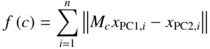

**icp - Jonathan's Iterative Closest Point Library**
---------
---------

**Overview**
--------

This library implements a few variants of the Iterative Closest Point algorithm for bringing two point clouds (PC1 and PC2 in to correspondence):

0. SVD to find the eigen vectors of the cross-covaraince matrix **(standard technique)**
1. A custom solution using BFGS **(non-standard technique)**
2. A custom solution using PSO **(non-standard technique)**
3. A implementation of Shinji Umeyama's method described in "Least-Squares Estimation of Transformation Parameters Between Two Point Patterns" **(standard technique)**

You should use method (3) if you do not care about matching scale (rotation + translation only). You should use (1) if you need to match scale. You should use (2) if (1) has convergence issues and you should use (0) if (3) has convergence issues.

Methods (1) and (2) *ARE NOT* generic ICP implementations. They do not rely on any of the various closed form solutions for finding the 6DOF rigid body transform to bring two point clouds (PC1 and PC2) into correspondence. Instead, I use BFGS to perform gradient descent so that the function to bring PC1 onto PC2 can be as non-linear as you want; i.e. you can parameterize shear, non-linear projection and any other second order effects. 

This formulation is particularly useful when dealing with real-world 3D scans (from the Kinect for instance), where you need to be able to compensate for non-linear depth and FOV mismatch between devices. In general, I find that since the correspondence search (using KD trees) accounts for a huge percentage of the run-time, using BFGS is only slightly slower than the direct form quaternion methods, but is at the same time much more flexible.

For those who are curious, I use BFGS to solve the following objective function:

Where, `c` is the pose coefficient vector in `R^m`, `x_{PC1,i}` and `x_{PC2,i}` are the ith PC1 and PC2 correspondence pair in `R^3` and `M_c` is the user defined 4x3 linear transform for the given pose coefficient.

If you need shear and other non-linear components as part of the transformation then it should be easy to modify the code of methods (1) and (2) to do so.

**Compilation**
---------------

Building icp uses Visual Studio 2012 on Windows and there are no dependencies for the main library. For the correspondence search I use the nanoflann header library (included in the repo). If you want to run the example you will need freeglut, however the pre-compiled x64 binaries are in this repo.

The test project should just build and run since all 64bit dependencies are baked in. The code is cross platform (and compiles using gcc on Mac OS X), but I have not included any CMake files because I got sick of supporting them.

**Matlab Bindings**
---------------

I've included a wrapper for Matlab, which uses native double precision performance (so is a little slow but is very accurate). Build the icp project in icp.sln first (to create the required static library icp.lib), then run icp\matlab\compile_mex.m to generate the icp mex function. Finally, a demo of usage in Matlab is in icp\matlab\test_mex.m.

**Running**
---------------

If you build the test project (in icp.sln) then a simple glut window will show the ICP algorithm progressing. Press the right arrow to move forward to the next iteration, `m` to change method and `n` to turn normals on and off. For your own applications I would start from here.

**Style**
---------

This project follows the Google C++ style conventions: 

<http://google-styleguide.googlecode.com/svn/trunk/cppguide.xml>
